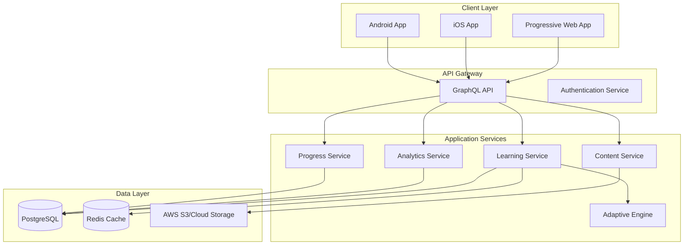

# Technical Specification: Stealth Learning Games SPA

## 1. System Architecture

### 1.1 High-Level Architecture



### 1.2 Technology Stack Details

#### Frontend Technologies
```json
{
  "core": {
    "framework": "React 18.2+",
    "language": "TypeScript 5.0+",
    "bundler": "Vite 5.0+",
    "package_manager": "pnpm"
  },
  "state_management": {
    "global": "Redux Toolkit",
    "local": "React Context + useReducer",
    "async": "RTK Query",
    "persistence": "Redux Persist"
  },
  "styling": {
    "framework": "Tailwind CSS 3.4+",
    "components": "CSS Modules",
    "animations": "Framer Motion",
    "icons": "Phosphor Icons"
  },
  "mobile": {
    "framework": "Capacitor 5.0+",
    "native_bridge": "Capacitor Plugins",
    "ios_min": "iOS 13+",
    "android_min": "Android 7+"
  }
}
```

#### Backend Technologies
```json
{
  "runtime": "Node.js 20 LTS",
  "framework": "NestJS 10+",
  "api": {
    "protocol": "GraphQL",
    "server": "Apollo Server 4",
    "subscriptions": "GraphQL Subscriptions"
  },
  "database": {
    "primary": "PostgreSQL 15+",
    "cache": "Redis 7+",
    "orm": "Prisma 5+",
    "migrations": "Prisma Migrate"
  },
  "services": {
    "auth": "Auth0/Supabase Auth",
    "storage": "AWS S3/Google Cloud Storage",
    "cdn": "CloudFront/Cloudflare",
    "analytics": "Custom + Google Analytics"
  }
}
```

## 2. Adaptive Learning Algorithm Implementation

### 2.1 Algorithm Core

```typescript
// Adaptive Learning Engine Core Implementation
interface StudentModel {
  id: string;
  ageGroup: '3-5' | '6-8' | '9';
  skillLevels: Map<string, SkillLevel>;
  learningStyle: LearningStyle;
  performanceHistory: PerformanceRecord[];
  currentZPD: ZoneOfProximalDevelopment;
}

interface SkillLevel {
  skill: string;
  currentRating: number; // Elo rating
  confidence: number; // 0-1
  lastAssessed: Date;
  masteryLevel: 'novice' | 'developing' | 'proficient' | 'advanced';
}

class AdaptiveLearningEngine {
  private readonly K_FACTOR = 32; // Elo K-factor
  private readonly ZPD_RANGE = 0.3; // ±30% of current ability
  
  calculateNextContent(
    student: StudentModel,
    availableContent: Content[],
    context: LearningContext
  ): Content {
    // Calculate student's current ability
    const currentAbility = this.calculateCompositeAbility(student);
    
    // Filter content within ZPD
    const zpdContent = availableContent.filter(content =>
      this.isWithinZPD(content.difficulty, currentAbility)
    );
    
    // Apply learning style preferences
    const styledContent = this.applyLearningStylePreferences(
      zpdContent,
      student.learningStyle
    );
    
    // Select optimal content based on multiple factors
    return this.selectOptimalContent(styledContent, student, context);
  }
  
  updateStudentModel(
    student: StudentModel,
    performance: PerformanceData
  ): StudentModel {
    const { skill, correct, responseTime, hintsUsed } = performance;
    
    // Calculate performance score (0-1)
    const performanceScore = this.calculatePerformanceScore(
      correct,
      responseTime,
      hintsUsed
    );
    
    // Update Elo rating
    const newRating = this.updateEloRating(
      student.skillLevels.get(skill)!.currentRating,
      performance.contentDifficulty,
      performanceScore
    );
    
    // Update skill level
    const updatedSkillLevel: SkillLevel = {
      ...student.skillLevels.get(skill)!,
      currentRating: newRating,
      confidence: this.updateConfidence(
        student.skillLevels.get(skill)!.confidence,
        performanceScore
      ),
      lastAssessed: new Date(),
      masteryLevel: this.calculateMasteryLevel(newRating)
    };
    
    // Update student model
    student.skillLevels.set(skill, updatedSkillLevel);
    student.performanceHistory.push(performance);
    student.currentZPD = this.recalculateZPD(student);
    
    return student;
  }
  
  private updateEloRating(
    currentRating: number,
    contentDifficulty: number,
    performance: number
  ): number {
    const expected = 1 / (1 + Math.pow(10, 
      (contentDifficulty - currentRating) / 400)
    );
    return currentRating + this.K_FACTOR * (performance - expected);
  }
  
  private isWithinZPD(
    contentDifficulty: number,
    studentAbility: number
  ): boolean {
    const lowerBound = studentAbility * (1 - this.ZPD_RANGE);
    const upperBound = studentAbility * (1 + this.ZPD_RANGE);
    return contentDifficulty >= lowerBound && contentDifficulty <= upperBound;
  }
}
```

### 2.2 Content Difficulty Calibration

```typescript
interface ContentCalibration {
  contentId: string;
  baseDifficulty: number;
  ageAdjustments: Map<string, number>;
  prerequisiteSkills: string[];
  averageCompletionTime: number;
  successRate: number;
}

class DifficultyCalibrator {
  calibrateContent(
    content: Content,
    performanceData: PerformanceData[]
  ): ContentCalibration {
    // Statistical analysis of performance data
    const successRate = this.calculateSuccessRate(performanceData);
    const avgTime = this.calculateAverageTime(performanceData);
    
    // Item Response Theory (IRT) calibration
    const irtDifficulty = this.performIRTAnalysis(performanceData);
    
    // Age-specific adjustments
    const ageAdjustments = this.calculateAgeAdjustments(performanceData);
    
    return {
      contentId: content.id,
      baseDifficulty: irtDifficulty,
      ageAdjustments,
      prerequisiteSkills: content.prerequisites,
      averageCompletionTime: avgTime,
      successRate
    };
  }
}
```

## 3. Game Mechanics Implementation

### 3.1 Core Game Loop

```typescript
class GameEngine {
  private state: GameState;
  private renderer: GameRenderer;
  private inputHandler: InputHandler;
  private adaptiveEngine: AdaptiveLearningEngine;
  
  async initialize(config: GameConfig): Promise<void> {
    this.state = await this.loadGameState(config);
    this.renderer = new GameRenderer(config.canvas);
    this.inputHandler = new InputHandler(config.inputType);
    
    // Start game loop
    this.startGameLoop();
  }
  
  private startGameLoop(): void {
    const FPS = 60;
    const frameTime = 1000 / FPS;
    let lastTime = 0;
    
    const gameLoop = (currentTime: number): void => {
      const deltaTime = currentTime - lastTime;
      
      if (deltaTime >= frameTime) {
        this.update(deltaTime);
        this.render();
        lastTime = currentTime;
      }
      
      requestAnimationFrame(gameLoop);
    };
    
    requestAnimationFrame(gameLoop);
  }
  
  private update(deltaTime: number): void {
    // Process input
    const input = this.inputHandler.getInput();
    
    // Update game state
    this.state = this.processGameLogic(this.state, input, deltaTime);
    
    // Check learning objectives
    this.checkLearningObjectives();
    
    // Update adaptive difficulty
    if (this.shouldAdjustDifficulty()) {
      this.adjustDifficulty();
    }
  }
  
  private checkLearningObjectives(): void {
    const objectives = this.state.currentLevel.learningObjectives;
    
    objectives.forEach(objective => {
      if (this.isObjectiveMet(objective)) {
        this.trackLearningProgress(objective);
        this.provideFeedback(objective);
      }
    });
  }
}
```

### 3.2 Reward System

```typescript
interface RewardSystem {
  points: PointSystem;
  badges: BadgeSystem;
  unlockables: UnlockableSystem;
  social: SocialRewardSystem;
}

class PointSystem {
  private multipliers: Map<string, number>;
  private streakBonus: number;
  
  calculatePoints(action: PlayerAction): number {
    let basePoints = this.getBasePoints(action);
    
    // Apply multipliers
    if (action.firstTry) basePoints *= 1.5;
    if (action.noHints) basePoints *= 1.3;
    if (action.speed === 'fast') basePoints *= 1.2;
    
    // Apply streak bonus
    basePoints *= (1 + this.streakBonus * 0.1);
    
    return Math.round(basePoints);
  }
}

class BadgeSystem {
  private badges: Badge[];
  private unlockedBadges: Set<string>;
  
  checkBadgeUnlock(playerStats: PlayerStatistics): Badge[] {
    const newBadges: Badge[] = [];
    
    this.badges.forEach(badge => {
      if (!this.unlockedBadges.has(badge.id) && 
          this.meetsCriteria(badge.criteria, playerStats)) {
        this.unlockedBadges.add(badge.id);
        newBadges.push(badge);
      }
    });
    
    return newBadges;
  }
}
```

## 4. UI Components Library

### 4.1 Age-Specific Components

```typescript
// Base component with age-specific variants
interface AgeAwareComponentProps {
  ageGroup: '3-5' | '6-8' | '9';
  children: React.ReactNode;
}

const Button: React.FC<ButtonProps & AgeAwareComponentProps> = ({
  ageGroup,
  onClick,
  children,
  ...props
}) => {
  const sizeClasses = {
    '3-5': 'min-h-[64px] text-2xl p-4',
    '6-8': 'min-h-[48px] text-xl p-3',
    '9': 'min-h-[40px] text-lg p-2'
  };
  
  const animationClasses = {
    '3-5': 'animate-bounce hover:scale-110',
    '6-8': 'hover:scale-105 transition-transform',
    '9': 'hover:bg-opacity-90 transition-colors'
  };
  
  return (
    <button
      className={cn(
        'rounded-lg font-bold',
        sizeClasses[ageGroup],
        animationClasses[ageGroup],
        props.className
      )}
      onClick={(e) => {
        // Add haptic feedback for mobile
        if ('vibrate' in navigator) {
          navigator.vibrate(10);
        }
        
        // Play sound effect
        playSound('buttonClick');
        
        onClick?.(e);
      }}
    >
      {children}
    </button>
  );
};
```

### 4.2 Game UI Components

```tsx
// Progress indicator with gamification
const ProgressBar: React.FC<ProgressProps> = ({
  current,
  total,
  showPercentage,
  animated,
  ageGroup
}) => {
  const percentage = (current / total) * 100;
  
  return (
    <div className="relative w-full">
      <div className="bg-gray-200 rounded-full overflow-hidden">
        <motion.div
          className="bg-gradient-to-r from-green-400 to-blue-500 h-6"
          initial={{ width: 0 }}
          animate={{ width: `${percentage}%` }}
          transition={{ duration: animated ? 1 : 0 }}
        />
      </div>
      
      {showPercentage && ageGroup !== '3-5' && (
        <span className="absolute right-2 top-1/2 transform -translate-y-1/2">
          {Math.round(percentage)}%
        </span>
      )}
      
      {ageGroup === '3-5' && (
        <div className="flex justify-between mt-2">
          {Array.from({ length: total }, (_, i) => (
            <Star
              key={i}
              filled={i < current}
              className="w-8 h-8"
            />
          ))}
        </div>
      )}
    </div>
  );
};

// Feedback modal with celebration animations
const FeedbackModal: React.FC<FeedbackProps> = ({
  type,
  message,
  onClose
}) => {
  useEffect(() => {
    if (type === 'success') {
      confetti({
        particleCount: 100,
        spread: 70,
        origin: { y: 0.6 }
      });
    }
  }, [type]);
  
  return (
    <AnimatePresence>
      <motion.div
        initial={{ scale: 0 }}
        animate={{ scale: 1 }}
        exit={{ scale: 0 }}
        className="fixed inset-0 flex items-center justify-center z-50"
      >
        <div className="bg-white rounded-2xl p-8 shadow-2xl">
          {type === 'success' && <SuccessAnimation />}
          {type === 'error' && <TryAgainAnimation />}
          
          <h2 className="text-3xl font-bold mt-4">
            {message}
          </h2>
          
          <Button
            ageGroup="6-8"
            onClick={onClose}
            className="mt-6"
          >
            Continue
          </Button>
        </div>
      </motion.div>
    </AnimatePresence>
  );
};
```

## 5. Data Models

### 5.1 Database Schema

```sql
-- Core user tables
CREATE TABLE students (
  id UUID PRIMARY KEY DEFAULT gen_random_uuid(),
  parent_id UUID REFERENCES parents(id),
  username VARCHAR(50) UNIQUE NOT NULL,
  age_group VARCHAR(10) NOT NULL CHECK (age_group IN ('3-5', '6-8', '9')),
  avatar_id INTEGER,
  learning_style VARCHAR(20),
  created_at TIMESTAMPTZ DEFAULT NOW(),
  updated_at TIMESTAMPTZ DEFAULT NOW()
);

CREATE TABLE skill_progress (
  id UUID PRIMARY KEY DEFAULT gen_random_uuid(),
  student_id UUID REFERENCES students(id) ON DELETE CASCADE,
  skill_id VARCHAR(100) NOT NULL,
  subject VARCHAR(20) NOT NULL,
  current_rating DECIMAL(10, 2) DEFAULT 1200,
  confidence DECIMAL(3, 2) DEFAULT 0.5,
  mastery_level VARCHAR(20) DEFAULT 'novice',
  total_attempts INTEGER DEFAULT 0,
  successful_attempts INTEGER DEFAULT 0,
  last_assessed TIMESTAMPTZ,
  created_at TIMESTAMPTZ DEFAULT NOW(),
  updated_at TIMESTAMPTZ DEFAULT NOW(),
  UNIQUE(student_id, skill_id)
);

CREATE TABLE learning_sessions (
  id UUID PRIMARY KEY DEFAULT gen_random_uuid(),
  student_id UUID REFERENCES students(id) ON DELETE CASCADE,
  started_at TIMESTAMPTZ DEFAULT NOW(),
  ended_at TIMESTAMPTZ,
  duration_seconds INTEGER,
  subject VARCHAR(20),
  games_played JSONB DEFAULT '[]',
  skills_practiced JSONB DEFAULT '[]',
  performance_summary JSONB,
  engagement_score DECIMAL(3, 2)
);

CREATE TABLE game_attempts (
  id UUID PRIMARY KEY DEFAULT gen_random_uuid(),
  session_id UUID REFERENCES learning_sessions(id) ON DELETE CASCADE,
  game_id VARCHAR(100) NOT NULL,
  started_at TIMESTAMPTZ DEFAULT NOW(),
  completed_at TIMESTAMPTZ,
  score INTEGER,
  max_score INTEGER,
  accuracy DECIMAL(5, 2),
  hints_used INTEGER DEFAULT 0,
  response_times JSONB,
  learning_objectives_met JSONB
);

-- Content management
CREATE TABLE educational_content (
  id VARCHAR(100) PRIMARY KEY,
  type VARCHAR(20) NOT NULL,
  subject VARCHAR(20) NOT NULL,
  difficulty_rating DECIMAL(10, 2),
  age_group VARCHAR(10),
  prerequisite_skills JSONB DEFAULT '[]',
  learning_objectives JSONB NOT NULL,
  content_data JSONB NOT NULL,
  metadata JSONB,
  created_at TIMESTAMPTZ DEFAULT NOW(),
  updated_at TIMESTAMPTZ DEFAULT NOW()
);

-- Analytics tables
CREATE TABLE engagement_metrics (
  id UUID PRIMARY KEY DEFAULT gen_random_uuid(),
  student_id UUID REFERENCES students(id) ON DELETE CASCADE,
  date DATE NOT NULL,
  total_time_minutes INTEGER DEFAULT 0,
  sessions_count INTEGER DEFAULT 0,
  games_completed INTEGER DEFAULT 0,
  skills_mastered INTEGER DEFAULT 0,
  engagement_score DECIMAL(3, 2),
  UNIQUE(student_id, date)
);

-- Indexes for performance
CREATE INDEX idx_skill_progress_student ON skill_progress(student_id);
CREATE INDEX idx_sessions_student_date ON learning_sessions(student_id, started_at);
CREATE INDEX idx_engagement_student_date ON engagement_metrics(student_id, date);
CREATE INDEX idx_content_subject_difficulty ON educational_content(subject, difficulty_rating);
```

### 5.2 API Schema (GraphQL)

```graphql
# Root Types
type Query {
  student(id: ID!): Student
  studentProgress(studentId: ID!, subject: Subject): ProgressReport
  learningSession(id: ID!): LearningSession
  recommendations(studentId: ID!): [Content!]!
  analytics(studentId: ID!, dateRange: DateRange!): AnalyticsReport
}

type Mutation {
  createStudent(input: CreateStudentInput!): Student!
  startLearningSession(studentId: ID!, subject: Subject!): LearningSession!
  submitGameResult(input: GameResultInput!): GameAttempt!
  updateSkillProgress(input: SkillProgressInput!): SkillProgress!
}

type Subscription {
  studentProgress(studentId: ID!): ProgressUpdate!
  liveEngagement(studentId: ID!): EngagementMetric!
}

# Domain Types
type Student {
  id: ID!
  username: String!
  ageGroup: AgeGroup!
  avatar: Avatar
  skillProgress: [SkillProgress!]!
  currentLevel(subject: Subject!): Int!
  achievements: [Achievement!]!
  stats: StudentStatistics!
}

type SkillProgress {
  skill: Skill!
  currentRating: Float!
  confidence: Float!
  masteryLevel: MasteryLevel!
  lastAssessed: DateTime
  history: [PerformanceRecord!]!
}

type LearningSession {
  id: ID!
  student: Student!
  startedAt: DateTime!
  endedAt: DateTime
  subject: Subject!
  gamesPlayed: [GameAttempt!]!
  skillsPracticed: [Skill!]!
  performanceSummary: PerformanceSummary
}

type Content {
  id: ID!
  type: ContentType!
  subject: Subject!
  difficulty: Float!
  prerequisites: [Skill!]!
  learningObjectives: [LearningObjective!]!
  estimatedDuration: Int!
}

# Enums
enum AgeGroup {
  AGE_3_5
  AGE_6_8
  AGE_9
}

enum Subject {
  MATHEMATICS
  ENGLISH
  SCIENCE
}

enum MasteryLevel {
  NOVICE
  DEVELOPING
  PROFICIENT
  ADVANCED
}

enum ContentType {
  GAME
  LESSON
  QUIZ
  CHALLENGE
}

# Input Types
input CreateStudentInput {
  username: String!
  ageGroup: AgeGroup!
  parentEmail: String!
}

input GameResultInput {
  sessionId: ID!
  gameId: String!
  score: Int!
  accuracy: Float!
  hintsUsed: Int!
  completionTime: Int!
  objectivesMet: [String!]!
}
```

## 6. Security Implementation

### 6.1 Authentication & Authorization

```typescript
// JWT-based authentication with refresh tokens
interface AuthService {
  login(credentials: LoginCredentials): Promise<AuthTokens>;
  refresh(refreshToken: string): Promise<AuthTokens>;
  logout(userId: string): Promise<void>;
  verifyToken(token: string): Promise<TokenPayload>;
}

class JWTAuthService implements AuthService {
  private readonly ACCESS_TOKEN_EXPIRY = '15m';
  private readonly REFRESH_TOKEN_EXPIRY = '7d';
  
  async login(credentials: LoginCredentials): Promise<AuthTokens> {
    // Validate credentials
    const user = await this.validateCredentials(credentials);
    
    // Generate tokens
    const accessToken = jwt.sign(
      { 
        userId: user.id,
        role: user.role,
        ageGroup: user.ageGroup 
      },
      process.env.JWT_SECRET!,
      { expiresIn: this.ACCESS_TOKEN_EXPIRY }
    );
    
    const refreshToken = jwt.sign(
      { userId: user.id },
      process.env.JWT_REFRESH_SECRET!,
      { expiresIn: this.REFRESH_TOKEN_EXPIRY }
    );
    
    // Store refresh token
    await this.storeRefreshToken(user.id, refreshToken);
    
    return { accessToken, refreshToken };
  }
  
  // COPPA compliance check
  async verifyParentalConsent(childData: ChildRegistration): Promise<boolean> {
    // Check age
    if (childData.age < 13) {
      // Require parental consent
      const consentToken = await this.sendParentalConsentEmail(
        childData.parentEmail
      );
      
      // Wait for consent confirmation
      return await this.waitForConsent(consentToken);
    }
    
    return true;
  }
}
```

### 6.2 Data Protection

```typescript
// Data encryption and privacy protection
class DataProtectionService {
  // Encrypt sensitive data at rest
  encryptPII(data: any): string {
    const algorithm = 'aes-256-gcm';
    const key = Buffer.from(process.env.ENCRYPTION_KEY!, 'hex');
    const iv = crypto.randomBytes(16);
    
    const cipher = crypto.createCipheriv(algorithm, key, iv);
    
    let encrypted = cipher.update(JSON.stringify(data), 'utf8', 'hex');
    encrypted += cipher.final('hex');
    
    const authTag = cipher.getAuthTag();
    
    return JSON.stringify({
      encrypted,
      authTag: authTag.toString('hex'),
      iv: iv.toString('hex')
    });
  }
  
  // Anonymize data for analytics
  anonymizeStudentData(studentData: StudentData): AnonymizedData {
    return {
      id: this.generatePseudonymousId(studentData.id),
      ageGroup: studentData.ageGroup,
      performanceMetrics: studentData.performanceMetrics,
      // Remove all PII
      username: undefined,
      email: undefined,
      realName: undefined
    };
  }
}
```

## 7. Performance Optimization

### 7.1 Frontend Optimization

```typescript
// Lazy loading and code splitting
const GameModules = {
  MathGame: lazy(() => import('./games/MathGame')),
  EnglishGame: lazy(() => import('./games/EnglishGame')),
  ScienceGame: lazy(() => import('./games/ScienceGame'))
};

// Image optimization
const ImageOptimizer = {
  generateSrcSet(imagePath: string): string {
    const sizes = [320, 640, 768, 1024, 1366];
    return sizes
      .map(size => `${imagePath}?w=${size} ${size}w`)
      .join(', ');
  },
  
  loadImageProgressive(src: string): Promise<void> {
    return new Promise((resolve) => {
      const img = new Image();
      
      // Load low quality first
      img.src = `${src}?quality=10`;
      img.onload = () => {
        // Then load high quality
        const highQuality = new Image();
        highQuality.src = `${src}?quality=90`;
        highQuality.onload = () => resolve();
      };
    });
  }
};

// Service Worker for caching
const CacheStrategy = {
  async cacheFirst(request: Request): Promise<Response> {
    const cache = await caches.open('v1');
    const cached = await cache.match(request);
    
    if (cached) {
      return cached;
    }
    
    const response = await fetch(request);
    cache.put(request, response.clone());
    return response;
  },
  
  async networkFirst(request: Request): Promise<Response> {
    try {
      const response = await fetch(request);
      const cache = await caches.open('v1');
      cache.put(request, response.clone());
      return response;
    } catch {
      const cached = await caches.match(request);
      if (cached) {
        return cached;
      }
      throw new Error('Network and cache both failed');
    }
  }
};
```

### 7.2 Backend Optimization

```typescript
// Database query optimization
class OptimizedQueries {
  // Batch loading to prevent N+1 queries
  async batchLoadStudentData(studentIds: string[]): Promise<Map<string, StudentData>> {
    const students = await this.db.student.findMany({
      where: { id: { in: studentIds } },
      include: {
        skillProgress: {
          where: { updatedAt: { gte: new Date(Date.now() - 30 * 24 * 60 * 60 * 1000) } }
        },
        achievements: true,
        recentSessions: {
          take: 10,
          orderBy: { startedAt: 'desc' }
        }
      }
    });
    
    return new Map(students.map(s => [s.id, s]));
  }
  
  // Materialized view for analytics
  async createAnalyticsMaterializedView(): Promise<void> {
    await this.db.$executeRaw`
      CREATE MATERIALIZED VIEW student_analytics AS
      SELECT 
        s.id as student_id,
        s.age_group,
        COUNT(DISTINCT ls.id) as total_sessions,
        AVG(ls.duration_seconds) as avg_session_duration,
        COUNT(DISTINCT ga.id) as games_completed,
        AVG(ga.accuracy) as avg_accuracy,
        COUNT(DISTINCT sp.skill_id) as unique_skills_practiced,
        MAX(ls.started_at) as last_active
      FROM students s
      LEFT JOIN learning_sessions ls ON s.id = ls.student_id
      LEFT JOIN game_attempts ga ON ls.id = ga.session_id
      LEFT JOIN skill_progress sp ON s.id = sp.student_id
      GROUP BY s.id, s.age_group;
      
      CREATE INDEX idx_analytics_student ON student_analytics(student_id);
    `;
  }
}
```

## 8. Testing Strategy

### 8.1 Unit Testing

```typescript
// Example unit test for adaptive algorithm
describe('AdaptiveLearningEngine', () => {
  let engine: AdaptiveLearningEngine;
  let mockStudent: StudentModel;
  
  beforeEach(() => {
    engine = new AdaptiveLearningEngine();
    mockStudent = createMockStudent({
      ageGroup: '6-8',
      skillLevels: new Map([
        ['addition', { currentRating: 1200, confidence: 0.7 }],
        ['subtraction', { currentRating: 1100, confidence: 0.5 }]
      ])
    });
  });
  
  describe('calculateNextContent', () => {
    it('should select content within student ZPD', () => {
      const content = [
        { id: '1', difficulty: 900 },  // Too easy
        { id: '2', difficulty: 1150 }, // Within ZPD
        { id: '3', difficulty: 1250 }, // Within ZPD
        { id: '4', difficulty: 1600 }  // Too hard
      ];
      
      const selected = engine.calculateNextContent(
        mockStudent,
        content,
        { subject: 'math' }
      );
      
      expect(['2', '3']).toContain(selected.id);
    });
    
    it('should update student model after performance', () => {
      const performance = {
        skill: 'addition',
        correct: true,
        responseTime: 5000,
        hintsUsed: 0,
        contentDifficulty: 1300
      };
      
      const updated = engine.updateStudentModel(mockStudent, performance);
      
      expect(updated.skillLevels.get('addition')!.currentRating)
        .toBeGreaterThan(1200);
      expect(updated.skillLevels.get('addition')!.confidence)
        .toBeGreaterThan(0.7);
    });
  });
});
```

### 8.2 Integration Testing

```typescript
// API integration tests
describe('Learning API', () => {
  let app: INestApplication;
  let studentId: string;
  
  beforeAll(async () => {
    const moduleFixture = await Test.createTestingModule({
      imports: [AppModule],
    }).compile();
    
    app = moduleFixture.createNestApplication();
    await app.init();
  });
  
  describe('POST /learning-session', () => {
    it('should create a new learning session', async () => {
      const response = await request(app.getHttpServer())
        .post('/graphql')
        .send({
          query: `
            mutation StartSession($studentId: ID!, $subject: Subject!) {
              startLearningSession(studentId: $studentId, subject: $subject) {
                id
                student { id }
                subject
                startedAt
              }
            }
          `,
          variables: {
            studentId,
            subject: 'MATHEMATICS'
          }
        })
        .expect(200);
      
      expect(response.body.data.startLearningSession).toMatchObject({
        student: { id: studentId },
        subject: 'MATHEMATICS'
      });
    });
  });
});
```

## 9. Deployment Configuration

### 9.1 Docker Configuration

```dockerfile
# Multi-stage build for production
FROM node:20-alpine AS builder

WORKDIR /app

# Install dependencies
COPY package*.json pnpm-lock.yaml ./
RUN npm install -g pnpm && pnpm install --frozen-lockfile

# Build application
COPY . .
RUN pnpm build

# Production stage
FROM node:20-alpine AS production

WORKDIR /app

# Copy built application
COPY --from=builder /app/dist ./dist
COPY --from=builder /app/node_modules ./node_modules
COPY --from=builder /app/package.json ./

# Security: Run as non-root user
RUN addgroup -g 1001 -S nodejs && \
    adduser -S nodejs -u 1001
USER nodejs

EXPOSE 3000

CMD ["node", "dist/main.js"]
```

### 9.2 Kubernetes Deployment

```yaml
apiVersion: apps/v1
kind: Deployment
metadata:
  name: stealth-learning-api
  namespace: production
spec:
  replicas: 3
  selector:
    matchLabels:
      app: stealth-learning-api
  template:
    metadata:
      labels:
        app: stealth-learning-api
    spec:
      containers:
      - name: api
        image: stealth-learning/api:latest
        ports:
        - containerPort: 3000
        env:
        - name: NODE_ENV
          value: "production"
        - name: DATABASE_URL
          valueFrom:
            secretKeyRef:
              name: db-secret
              key: url
        resources:
          requests:
            memory: "256Mi"
            cpu: "250m"
          limits:
            memory: "512Mi"
            cpu: "500m"
        livenessProbe:
          httpGet:
            path: /health
            port: 3000
          initialDelaySeconds: 30
          periodSeconds: 10
        readinessProbe:
          httpGet:
            path: /ready
            port: 3000
          initialDelaySeconds: 5
          periodSeconds: 5
---
apiVersion: v1
kind: Service
metadata:
  name: stealth-learning-api-service
spec:
  selector:
    app: stealth-learning-api
  ports:
    - protocol: TCP
      port: 80
      targetPort: 3000
  type: LoadBalancer
```

## 10. Monitoring and Observability

### 10.1 Application Monitoring

```typescript
// Custom metrics for learning platform
class LearningMetrics {
  private prometheus = new PrometheusClient();
  
  // Define custom metrics
  private metrics = {
    activeUsers: new this.prometheus.Gauge({
      name: 'learning_active_users',
      help: 'Number of currently active users',
      labelNames: ['age_group']
    }),
    
    learningSessionDuration: new this.prometheus.Histogram({
      name: 'learning_session_duration_seconds',
      help: 'Duration of learning sessions',
      labelNames: ['subject', 'age_group'],
      buckets: [60, 300, 600, 1200, 1800, 3600]
    }),
    
    skillMastery: new this.prometheus.Counter({
      name: 'skill_mastery_total',
      help: 'Total number of skills mastered',
      labelNames: ['skill', 'subject', 'age_group']
    }),
    
    adaptiveAdjustments: new this.prometheus.Counter({
      name: 'adaptive_adjustments_total',
      help: 'Number of difficulty adjustments made',
      labelNames: ['direction', 'subject']
    })
  };
  
  recordSessionStart(studentInfo: StudentInfo): void {
    this.metrics.activeUsers.inc({ age_group: studentInfo.ageGroup });
  }
  
  recordSessionEnd(session: SessionData): void {
    this.metrics.activeUsers.dec({ age_group: session.ageGroup });
    this.metrics.learningSessionDuration.observe(
      { subject: session.subject, age_group: session.ageGroup },
      session.duration
    );
  }
}
```

---

*Technical Specification Version: 1.0.0*  
*Last Updated: January 27, 2025*